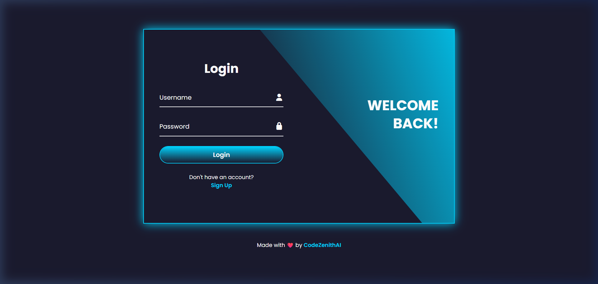
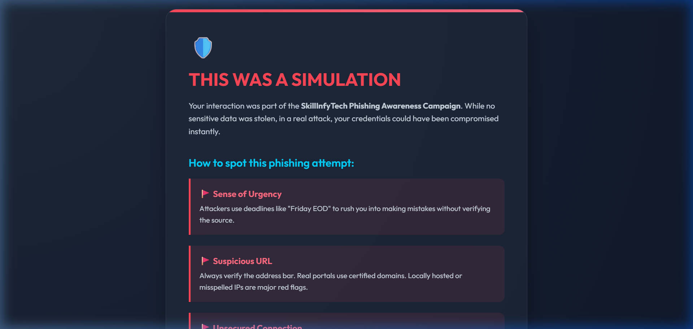

# 🎣 Project 6 — Social Engineering Awareness Simulation

> **SkillInfyTech IT Solutions | Cybersecurity Internship**

## 📌 Overview

This project is the final submission for the cybersecurity internship. It addresses the "Human Element" of security by creating a **Phishing Awareness Simulation**. 

The goal is to demonstrate how attackers create convincing fake login portals to steal credentials and then provide users with immediate, actionable education on how to identify these threats in the future.

## 📸 Visual Demo

### 1. Phishing Bait Landing Page
This is the fake login portal designed to mimic a corporate environment with a professional look and feel.


### 2. Upgraded Security Awareness Page
Once the user "submits" their credentials, they are immediately redirected to this educational dashboard.


## 🛠️ Tools Used

| Tool | Purpose |
|------|---------|
| **Python 3.14 (Flask)** | Backend for the simulation server |
| **HTML/CSS** | Frontend for the fake portal (UI/UX) |
| **Python Logging** | Capturing interaction metrics (without storing passwords) |

## 📁 Project Structure

```
project6-social-engineering/
├── README.md                  # This file
├── .gitignore
├── app.py                     # The Flask simulation engine
├── templates/
│   ├── login.html             # The "Phishing Bait" login page
│   └── warning.html           # The "Education" landing page
├── lab/
│   ├── phishing_email.html    # A mockup of the phishing email bait
│   └── captured_clicks.log    # Simulation interaction logs
└── reports/
    └── project6_social_engineering.md  # Final assessment report
```

## 🚀 How to Run

### Step 1: Start the Simulation
```bash
python app.py
```
Access the simulation portal at `http://127.0.0.1:5000`.

### Step 2: Test the Flow
1. Navigate to the homepage.
2. Enter any test credentials (e.g., `test@example.com` / `password`).
3. Observe the redirect to the **Warning Page** and review the "Red Flags" highlighted.

## 📊 Key Concepts Covered
- **Phishing**: A form of social engineering where attackers masquerade as trusted entities.
- **Red Flags**: Indicators of a phishing attempt (e.g., suspicious URLs, urgent tone, incorrect sender domain).
- **Security Awareness Training**: The process of educating employees to recognize and report threats.
- **Credential Harvesting**: The collection of login data via fraudulent forms.

## ✅ Final Project Submission
This concludes the 6-project sequence for the SkillInfyTech IT Solutions Cybersecurity Internship.
